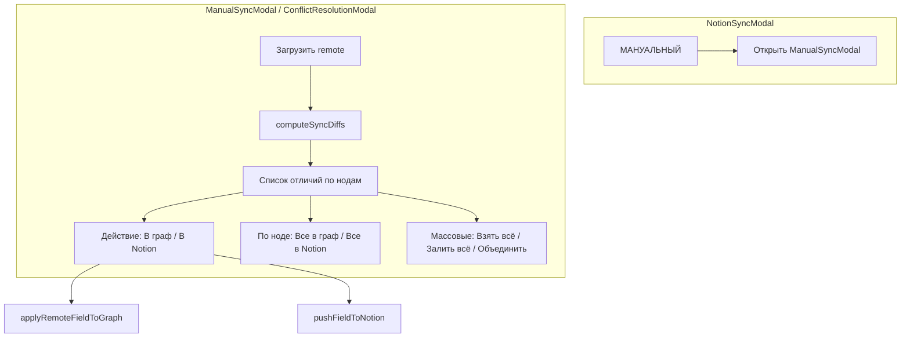

# План: Manual Sync и окно разрешения конфликтов

## Цель

Новый тип разовой синхронизации «МАНУАЛЬНЫЙ»: кнопка открывает окно со списком отличий (граф vs Notion), где можно по одному применять изменения, по ноде или массово. То же окно — для будущего разрешения конфликтов.

## Архитектура




## 1. Типы и API

### 1.1. Новые типы в [src/types/index.ts](src/types/index.ts)

```ts
/** Одно отличие при сравнении графа и Notion */
export interface SyncDiffItem {
  nodeId: string;
  nodeLabel: string;
  notionPageId?: string;
  /** position | label | act | stage | category | powerType | ... */
  field: string;
  fieldLabel: string;
  localValue: unknown;
  remoteValue: unknown;
  /** 'both' = есть в обеих, 'localOnly' = только локально, 'remoteOnly' = только в Notion */
  kind: 'both' | 'localOnly' | 'remoteOnly';
}

/** Режим открытия ManualSyncModal */
export type ManualSyncMode = 'diff' | 'conflicts';
```

### 1.2. API в [src/utils/notionApi.ts](src/utils/notionApi.ts)

- **computeSyncDiffs(localNodes, remoteNodes, columnMapping)** — сравнение local vs remote по полям (position, label, techForAct, stage, category, powerType, gameStatus, designStatus, notionSyncStatus, openCondition). Возвращает `SyncDiffItem[]`. Группировка по nodeId — на уровне UI.
- **pushNodeToNotion(node, edges, config, nodeMap, corsProxy)** — уже можно через `pushToNotion(nodes, edges, config, corsProxy, undefined, new Set([node.id]))`.
- **pushNodePropertyToNotion(pageId, field, value, config, edges?, nodeMap?)** — PATCH одной свойства в Notion. Для position — editorPosition; для label — workingName и т.д. Потребуется маппинг field → Notion column + формат значения.

### 1.3. Утилита сравнения

Отдельная функция `computeSyncDiffs` в `notionApi.ts` или `syncDiff.ts`:

- Сопоставление по notionPageId и techCraftId.
- Для каждой пары: сравнить position, затем поля из NodeData (label, techForAct, stage, category и т.д.).
- Ноды только в local (без notionPageId или без соответствия в remote) → `localOnly` (можно "добавить в Notion").
- Ноды только в remote → `remoteOnly` (можно "добавить в граф").

## 2. Store

### 2.1. Новая модалка в [src/store/useStore.ts](src/store/useStore.ts)

- В `modals` добавить `manualSync: boolean`.
- Расширить `setModalOpen` для `'manualSync'`.
- Добавить `manualSyncMode: ManualSyncMode` и `setManualSyncMode` (или передавать при открытии).

### 2.2. Действия для применения изменений

- **applyRemoteFieldToGraph(nodeId, field, value)** — применить одно поле с remote к локальной ноде:
  - `field === 'position'` → обновить `node.position` через `setNodes`.
  - иначе → `updateNodeData(nodeId, { [field]: value })`.
- **updateNodePosition(nodeId, position)** — отдельное действие в store для обновления позиции одной ноды (опционально, можно обойтись через `setNodes`).

## 3. Компонент ManualSyncModal

### 3.1. Файл [src/components/ManualSyncModal.tsx](src/components/ManualSyncModal.tsx) (новый)

Структура:

- Заголовок: «Ручная синхронизация» / «Разрешение конфликтов» (по режиму).
- При открытии: fetch remote (`pullFromNotion`), затем `computeSyncDiffs(localNodes, remoteNodes)`.
- Состояние: `diffs: SyncDiffItem[]`, `loading`, `error`, `remoteNodes`, `remoteEdges`.

### 3.2. Список отличий

- Группировка по ноде (nodeLabel / nodeId).
- Строка отличия: `fieldLabel | Локально: X | Notion: Y` + кнопки:
  - «В граф» — применить remote к локальному графу.
  - «В Notion» — отправить local в Notion.
- Для `localOnly`: кнопка «Добавить в Notion».
- Для `remoteOnly`: кнопка «Добавить в граф».

### 3.3. Кнопки по ноде

- «Взять всё из Notion» — применить все remote-поля для этой ноды к графу.
- «Залить всё в Notion» — отправить все local-поля этой ноды в Notion.

### 3.4. Массовые кнопки

- «Взять всё из Notion» — pullFromNotion + replaceNodesAndEdgesForSync.
- «Залить всё в Notion» — pushToNotion (все dirty или все nodes).
- «Объединить (новее побеждает)» — вызвать `bidirectionalSync`, применить результат.
- «Закрыть» — закрыть модалку.

### 3.5. Будущее использование для конфликтов

При `mode === 'conflicts'`:

- Входные данные — `SyncConflict[]` (или общий формат, совместимый с `SyncDiffItem`).
- Отображение и кнопки те же: «В граф» / «В Notion» на каждый конфликт.
- Массовые действия по конфликтам: принять все local, принять все remote.

## 4. Интеграция в NotionSyncModal

### 4.1. Кнопка «МАНУАЛЬНЫЙ»

В секции «Разовые действия» ([NotionSyncModal.tsx](src/components/NotionSyncModal.tsx), после «Двусторонне»):

- Новая кнопка «МАНУАЛЬНЫЙ» с иконкой (например, Hand или SlidersHorizontal).
- При клике: `setModalOpen('manualSync', true)`, `setManualSyncMode('diff')` (если нужно), можно временно скрыть NotionSyncModal или оставить открытой (модалки могут быть вложенными/стопкой).

### 4.2. Рендер ManualSyncModal

- Добавить `<ManualSyncModal />` в App/Layout рядом с другими модалками.
- `isOpen={modals.manualSync}`.

## 5. Порядок реализации


| Шаг | Задача                                                                              |
| --- | ----------------------------------------------------------------------------------- |
| 1   | Типы `SyncDiffItem`, `ManualSyncMode` в `types/index.ts`                            |
| 2   | `computeSyncDiffs` в `notionApi.ts`                                                 |
| 3   | `pushNodePropertyToNotion` (или использовать существующий push с одним node)        |
| 4   | Store: `modals.manualSync`, `setModalOpen('manualSync')`, `applyRemoteFieldToGraph` |
| 5   | Компонент `ManualSyncModal` с UI списка, кнопок по строке, по ноде и массовых       |
| 6   | Кнопка «МАНУАЛЬНЫЙ» в `NotionSyncModal` и рендер `ManualSyncModal`                  |
| 7   | Подготовка к режиму конфликтов: props `mode`, `conflicts?: SyncConflict[]`          |


## 6. Важные детали

- **Поля для сравнения**: position, label (workingName), techForAct, stage, category, powerType, gameStatus, designStatus, notionSyncStatus, openCondition. Остальные — по необходимости.
- **Формат значений**: для отображения — `JSON.stringify` для объектов, для примитивов — как есть.
- **Редакция позиции в Notion**: через свойство `editorPosition` (JSON `{x,y}`).
- **Режим конфликтов**: позже `bidirectionalSync` может возвращать `conflicts`. При `conflicts.length > 0` открывать `ManualSyncModal` в режиме `conflicts` с этими данными. Структура `SyncConflict` уже есть; можно преобразовать в `SyncDiffItem` для единого UI.

